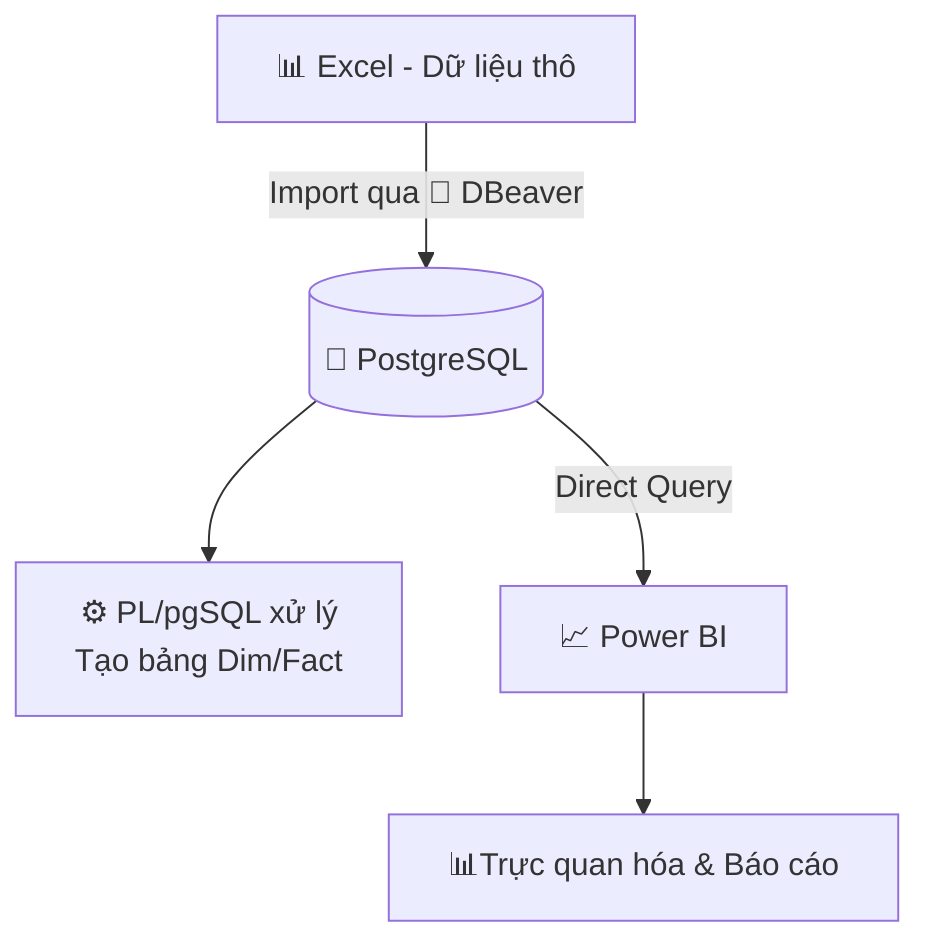

# 📘 Báo cáo kết quả kinh doanh

## 🔹 Giới thiệu 
Project này được xây dựng nhằm giải quyết bài toán **dữ liệu tài chính trong ngân hàng** đang phân tán ở nhiều nguồn và thiếu công cụ theo dõi tập trung.  
Mục tiêu là **xây dựng data pipeline chuẩn hóa** từ raw data → dashboard, giúp ban lãnh đạo nắm bắt kịp thời tình hình tài chính và hỗ trợ ra quyết định nhanh chóng.  

---

## 1. Ngữ cảnh
- Dữ liệu tài chính đang phân tán ở nhiều nguồn (core banking, excel thủ công, báo cáo chi nhánh).  
- Báo cáo hiện tại làm thủ công → chậm, thiếu tính kịp thời, khó phát hiện sớm rủi ro.  
- Ban lãnh đạo cần một công cụ trực quan, nhanh chóng để theo dõi hoạt động.  

---

## 2. Mục tiêu
- Chuẩn hóa dữ liệu tài chính toàn hệ thống.  
- Theo dõi KPI: **Thu nhập, Chi phí, Lợi nhuận trước thuế**.  
- Kiểm soát chỉ số: **CIR (%), Margin (%), Hiệu suất vốn (%)**.  
- Theo dõi chỉ số theo **từng nhân sự**.  
- Hỗ trợ ra quyết định nhanh cho **HĐQT & Ban Điều hành**.  

---

## 3. Flowchart

---

## 4. Các bước thực hiện

### 4a. EDA → Glossary
- Thực hiện EDA trên dữ liệu thô (Excel/CSV).  
- Làm sạch dữ liệu, kiểm tra giá trị null, outlier.  
- Xây dựng **glossary**: định nghĩa các field, quy tắc mapping nghiệp vụ.  

👉 Ảnh minh họa:  

---

### 4b. Tổ chức bảng dữ liệu dim , fact.
- Tạo script `ddl_dim.sql`, `ddl_fact.sql`.  
- Tổ chức dữ liệu theo mô hình Data Warehouse.  

👉 Ảnh minh họa:  

---

### 4c. Import dữ liệu
- Import dữ liệu vào **PostgreSQL** thông qua **DBeaver**.  
- Viết script `mapping.sql` để kiểm tra ánh xạ dữ liệu giữa raw data → postgres.  

👉 Ảnh minh họa:  

---

### 4d. Procedure
- Viết các procedure (PL/pgSQL) để xử lý logic nghiệp vụ.  
- Ví dụ: tính chi phí, thống kê giao dịch, số lượng nhân viên , tính toán KPI...
 

👉 Ảnh minh họa:  

---

### 4e. Power BI Query
- Tạo các views để phục vụ Power BI   
- Kết nối Power BI với PostgreSQL bằng cách sử dụng Direct Query.  

👉 Ảnh minh họa:  

---

### 4f. Page Dashboard
- Thiết kế dashboard trực quan bằng Power BI. 
- Ví dụ các page : Tổng quan doanh nghiệp , Báo cáo kết quả kinh doanh , Báo cáo nhân sự , Tổng quan KPI - ASM ...
- Demo online: [Link Power BI Demo](#) *(cập nhật sau)*  

👉 Ảnh minh họa:  

---

## 5. Giá trị đạt được (Gain Value)
- Thành thạo **SQL & PL/SQL** trong xử lý dữ liệu.  
- Sử dụng **DBeaver** để quản lý database.  
- Kỹ năng xây dựng **Power BI Dashboard** trực quan đạt mức khá.  
- Hiểu rõ **end-to-end data pipeline**: từ raw data → postgres → báo cáo.
-  Có cái nhìn trực quan về luồng xử lí , phân tích báo cáo. 
- Bổ sung kiến thức nghiệp vụ **fintech (sao kê thẻ, chỉ số tài chính, tín dụng)**.
  
---

## 6. Hướng dẫn sử dụng

### Yêu cầu môi trường
- **Database**: PostgreSQL  
- **Công cụ quản trị**: DBeaver  
- **Visualization**: Power BI Desktop hoặc Power BI Service  

### Các bước chạy
1. Tạo schema trong PostgreSQL.  
2. Chạy các script trong `scripts/ddl/` để tạo bảng raw, dim, fact.  
3. Import dữ liệu từ Excel/CSV vào PostgreSQL (qua DBeaver).  
4. Chạy `scripts/mapping.sql` để validate dữ liệu.  
5. Chạy các procedure trong `scripts/procedures/` để xử lý logic nghiệp vụ.  
6. Kết nối Power BI với PostgreSQL qua Direct Query.  
7. Import query trong `scripts/pbi/queries.sql` và dựng dashboard.  

---

